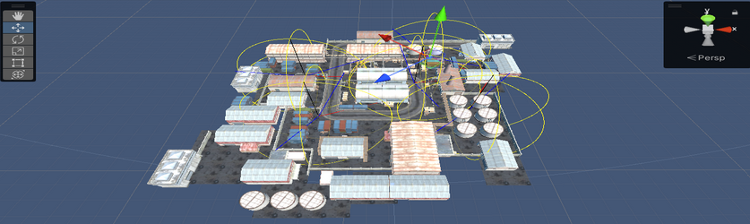
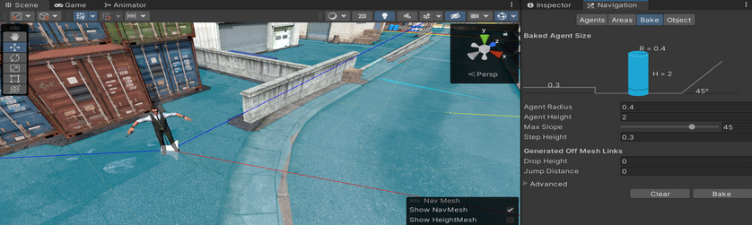
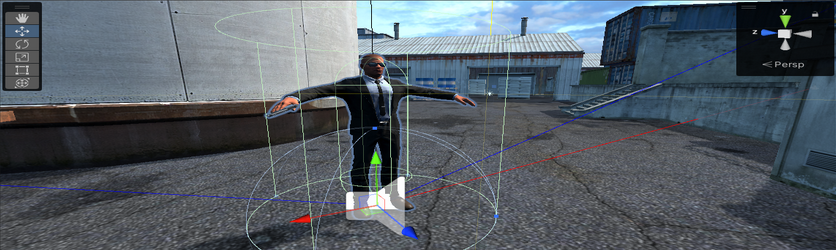
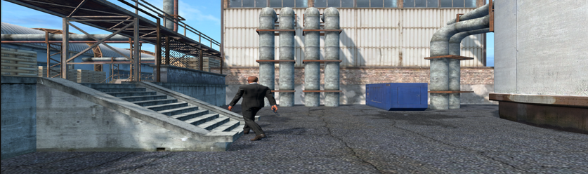
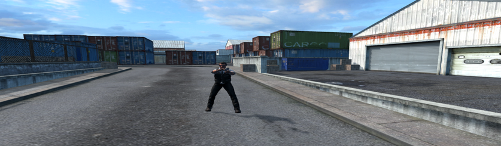
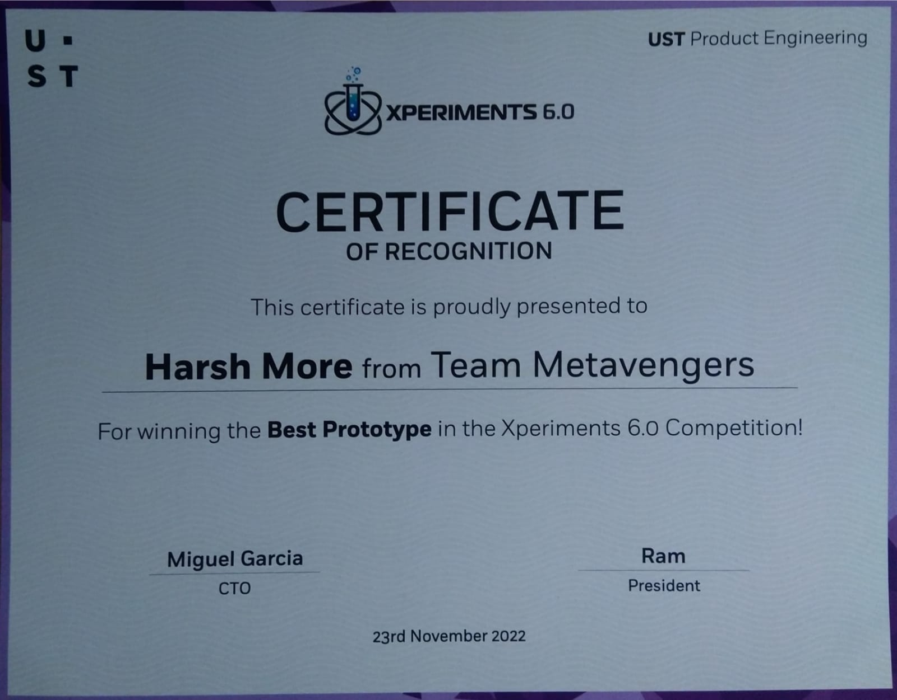

# VR-FPS
## VR FPS Game using Unity + Oculus Quest 2

<h2> Abstract </h2>

With advancements in the field of virtual reality and the boom of metaverse, the technology underlying modern games is progressing rapidly. Virtual reality along with modern Artificial Intelligence algorithms have resulted in impressive results and immersive experiences for users.

This project aims to make a first-person shooting VR game. The game enables users to use guns for shooting enemy agents. These agents have been trained to navigate the map using Navmesh Agent, and shoot us whenever they sense our presence. The game ends if the user kills every agent before his health level finishes. This project highlights the potential of VR in making games more interactive and impressive. 

<h2> Implementation </h2>

 Implementation is divided into main 3 components: 

* Game map designing and leveling and prefabs setup.  
* Scripting and Animation Enemy Agents.  
* Integration of XR interaction toolkit with oculus quest 2.  

<h2> Results </h2>

 

<h2>GitHub Link: </h2>
<a href="https://github.com/moreharsh/VR-FPS"> https://github.com/moreharsh/VR-FPS </a>

<h2> Assets used for this project: </h2>

* <a href="https://assetstore.unity.com/packages/tools/integration/oculus-integration-82022#description"> Oculus Integration </a>
* <a href="https://assetstore.unity.com/packages/essentials/asset-packs/standard-assets-for-unity-2018-4-32351#publisher"> Standard Assets (for Unity 2018.4) </a>
* <a href="https://assetstore.unity.com/packages/3d/characters/humanoids/humans/bodyguards-31711#description"> Bodyguards </a>
* <a href="https://assetstore.unity.com/packages/3d/environments/industrial/rpg-fps-game-assets-for-pc-mobile-industrial-set-v3-0-101429#description"> RPG/FPS Game Assets for PC/Mobile (Industrial Set v3.0) </a>
* <a href="https://assetstore.unity.com/packages/3d/props/guns/modern-guns-handgun-129821#description"> Modern Guns: Handgun </a>

 Special Thanks to all publishers, for providing such great assets for free.

<h2> Best Prototype Award @Xperiments 6.0: </h2>

